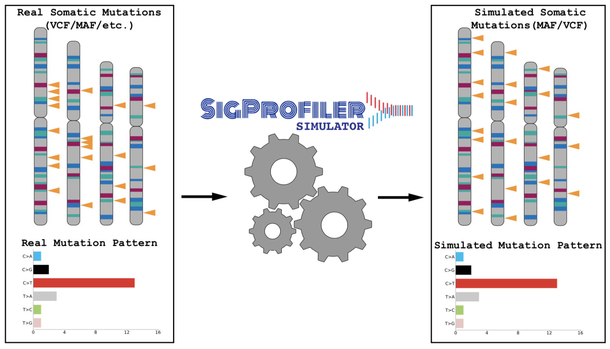

[](https://osf.io/usxjz/wiki/home/) [](https://opensource.org/licenses/BSD-2-Clause) [](https://travis-ci.com/AlexandrovLab/SigProfilerSimulatorR)

# SigProfilerSimulatorR
An R wrapper for running the SigProfilerSimulator (https://osf.io/usxjz/wiki/home/) framework.

**INTRODUCTION**

The purpose of this document is to provide a guide for using the SigProfilerSimulator framework to simulate mutational signatures in cancer. It allows for realistic simulations of single point mutations, double point mutations, and insertions/deletions with the goal of providing a background model for statistical analysis. The simulations are performed in an unbiased fashion, relying on random chance as the main distribution and can be performed across the entire genome or limited to user-provided ranges.. An extensive Wiki page detailing the usage of this tool can be found at https://osf.io/usxjz/wiki/home/. For users that prefer working in a Python environment, the tool is written in Python and can be found and installed from: https://github.com/AlexandrovLab/SigProfilerSimulator



**PREREQUISITES**

devtools  (R) 
```
>> install.packages("devtools")
```
reticulate* (R) 
```
>> install.packages("reticulate")  
```

*Reticulate has a known bug of preventing python print statements from flushing to standard out. As a result, some of the typical progress messages are delayed.

SigProfilerMatrixGenerator (Python)
*See the README file for installing SigProfilerMatrixGenerator or visit the documentation page: https://osf.io/s93d5/wiki/home/

**QUICK START GUIDE**

This section will guide you through the minimum steps required to create mutational matrices:
1. First, install the python package using pip. The R wrapper still requires the python package:
```
                          pip install SigProfilerSimulator
```
2. Open an R session and ensure that your R interpreter recognizes the path to your python3 installation:
```
$ R
>> library("reticulate")
>> use_python("path_to_your_python3")
>> py_config()
python:         /anaconda3/bin/python3
libpython:      /anaconda3/lib/libpython3.6m.dylib
pythonhome:     /anaconda3:/anaconda3
version:        3.6.5 |Anaconda, Inc.| (default, Apr 26 2018, 08:42:37)  [GCC 4.2.1 Compatible Clang 4.0.1 (tags/RELEASE_401/final)]
numpy:          /anaconda3/lib/python3.6/site-packages/numpy
numpy_version:  1.16.1
```
If you do not see your python3 path listed, restart your R session and rerun the above commands in order.

2. Install SigProfilerSimulatorR using devtools:
```
>>library("devtools")
>>install_github("AlexandrovLab/SigProfilerSimulatorR")
```
3. Load the package in the same R session: 
```
>> library("SigProfilerSimulatorR")
```

4. Place your vcf files in your desired output folder. It is recommended that you name this folder based on your project's name

5. From within the same R session, you can now simulate mutational patterns/signatures as follows:
```
>> library("SigProfilerSimulatorR")
>> SigProfilerSimulatorR("BRCA", "/Users/ebergstr/Desktop/BRCA/", "GRCh37", contexts=c("96"), exome=NULL, simulations=100, updating=FALSE, bed_file=NULL, overlap=FALSE, gender='female',  chrom_based=FALSE, seed_file=NULL, noisePoisson=FALSE, noiseAWGN=0, cushion=100, region=NULL)
```
  The layout of the required parameters are as follows:
  
      SigProfilerSimulatorR ( project, project_path, genome, contexts)
            
  where project, project_path, and genome must be strings (surrounded by quotation marks, ex: "test"), and contexts is a list of the desired contexts to simulate (ex: contexts=c("96", "ID")) Optional
  parameters include:
  
      exome=NULL:       [boolean] Simulates on the exome of the reference genome
      simulations=1:	       [integer] Number of desired iterations per sample. Default is 1 iteration.
      updating=FALSE:       [boolean] Updated the chromosome with each mutation. Default is FALSE.
      bed_file=NULL:      [string path to bed_file] Simulates on custom regions of the genome. Requires the full path to the BED file. 
      overlap=FALSE:       [boolean] Allows overlapping of mutations along the chromosome. Default is FALSE.
      gender='female':       [string] Simulate male or female genomes. Default is 'female'
      chrom_based=FALSE  [boolean] Maintains the same catalogs of mutations on a per chromosome basis.
      seed_file=NULL:       [string] Path to user defined seeds. One seed is required per processor. Uses a built in file by default
      noisePoisson=FALSE:       [boolean] Add poisson noise to the simulations. Default is FALSE.     
      noiseAWGN=0:       [integer] Add a noise dependent on a +/- allowance of noise (ex: noiseAWGN=5 allows +/-2.5\% of mutations for each mutation type). Default is 0 noise. 
      cushion=100:       [integer] Allowable cushion when simulating on the exome or targetted panel. Default is 100 base pairs
      region=NULL:       [string] Path to targetted region panel for simulated on a user-defined region. Default is whole-genome simulations.
  


**INPUT FILE FORMAT**

This tool currently supports maf, vcf, simple text file, and ICGC formats. The user must provide variant data adhering to one of these four formats. If the users' files are in vcf format, each sample must be saved as a separate files. 


**Output File Structure**

The output structure is divided into three folders: input, output, and logs. The input folder contains copies of the user-provided input files. The output folder contains
a DBS, SBS, ID, and simulations folder. The matrices are saved into the appropriate folders, and the simulations are found within a project specific folder under simulations. The logs folder contains the error and log files for the submitted job.


**SUPPORTED GENOMES**

This tool currently supports the following genomes:

GRCh38.p12 [GRCh38] (Genome Reference Consortium Human Reference 37), INSDC
Assembly GCA_000001405.27, Dec 2013. Released July 2014. Last updated January 2018. This genome was downloaded from ENSEMBL database version 93.38.

GRCh37.p13 [GRCh37] (Genome Reference Consortium Human Reference 37), INSDC
Assembly GCA_000001405.14, Feb 2009. Released April 2011. Last updated September 2013. This genome was downloaded from ENSEMBL database version 93.37. 

GRCm38.p6 [mm10] (Genome Reference Consortium Mouse Reference 38), INDSDC
Assembly GCA_000001635.8, Jan 2012. Released July 2012. Last updated March 2018. This genome was downloaded from ENSEMBL database version 93.38. 

GRCm37 [mm9] (Release 67, NCBIM37), INDSDC Assembly GCA_000001635.18.
Released Jan 2011. Last updated March 2012. This genome was downloaded from ENSEMBL database version release 67.

rn6 (Rnor_6.0) INSDC Assembly GCA_000001895.4, Jul 2014. Released Jun 2015. Last updated Jan 2017. 
This genome was downloaded from ENSEMBL database version 96.6.

**LOG FILES**

All errors and progress checkpoints are saved into *sigProfilerSimulator_[project]_[genome].err* and *sigProfilerSimulator_[project]_[genome].out*, respectively. 
For all errors, please email the error and progress log files to the primary contact under CONTACT INFORMATION.

**CITATION**

Erik N. Bergstrom, Mark Barnes, Iñigo Martincorena, Ludmil B. Alexandrov
bioRxiv 2020.02.13.948422; doi: https://doi.org/10.1101/2020.02.13.948422
https://www.biorxiv.org/content/10.1101/2020.02.13.948422v1

**COPYRIGHT**

Copyright (c) 2020, Erik Bergstrom [Alexandrov Lab] All rights reserved.

Redistribution and use in source and binary forms, with or without modification, are permitted provided that the following conditions are met:

Redistributions of source code must retain the above copyright notice, this list of conditions and the following disclaimer.

Redistributions in binary form must reproduce the above copyright notice, this list of conditions and the following disclaimer in the documentation and/or other materials provided with the distribution.

THIS SOFTWARE IS PROVIDED BY THE COPYRIGHT HOLDERS AND CONTRIBUTORS "AS IS" AND ANY EXPRESS OR IMPLIED WARRANTIES, INCLUDING, BUT NOT LIMITED TO, THE IMPLIED WARRANTIES OF MERCHANTABILITY AND FITNESS FOR A PARTICULAR PURPOSE ARE DISCLAIMED. IN NO EVENT SHALL THE COPYRIGHT HOLDER OR CONTRIBUTORS BE LIABLE FOR ANY DIRECT, INDIRECT, INCIDENTAL, SPECIAL, EXEMPLARY, OR CONSEQUENTIAL DAMAGES (INCLUDING, BUT NOT LIMITED TO, PROCUREMENT OF SUBSTITUTE GOODS OR SERVICES; LOSS OF USE, DATA, OR PROFITS; OR BUSINESS INTERRUPTION) HOWEVER CAUSED AND ON ANY THEORY OF LIABILITY, WHETHER IN CONTRACT, STRICT LIABILITY, OR TORT (INCLUDING NEGLIGENCE OR OTHERWISE) ARISING IN ANY WAY OUT OF THE USE OF THIS SOFTWARE, EVEN IF ADVISED OF THE POSSIBILITY OF SUCH DAMAGE. 

**CONTACT INFORMATION**

Please address any queries or bug reports to Erik Bergstrom at ebergstr@eng.ucsd.edu
